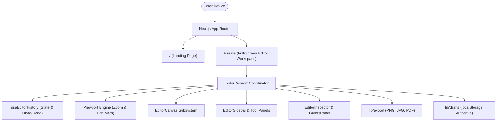
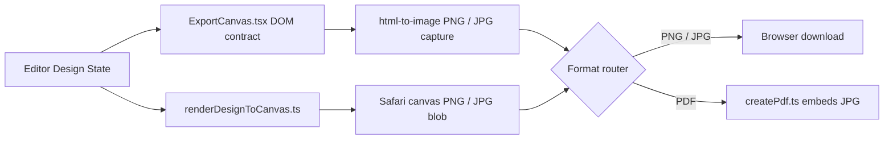

# Gripix System Architecture

This document describes the high-level system architecture, component relationships, data flow, and subsystem organization of Gripix.

---

## 1. System Overview

Gripix is built on **Next.js (App Router)**, **TypeScript**, **React 19**, and **Tailwind CSS**. It is architected as a high-performance, client-side graphic design application with local draft persistence and multi-format client-side export capabilities.

---

## 2. Route & Layout Architecture

- **`/` (Public Landing Page - [`app/page.tsx`](../app/page.tsx))**:
  - Responsive marketing landing page presenting Gripix features, Canva-style editor capabilities, and direct entry points to launch the editor.
- **`/create` (Editor Workspace Route - [`app/create/page.tsx`](../app/create/page.tsx))**:
  - Dedicated full-screen viewport workspace (`min-h-dvh md:h-dvh md:overflow-hidden`) hosting [`EditorPreview.tsx`](../components/EditorPreview.tsx).

---

## 3. Editor Core Architecture ([`components/EditorPreview.tsx`](../components/EditorPreview.tsx))

[`EditorPreview.tsx`](../components/EditorPreview.tsx) serves as the central stateful coordinator for the entire design application. It maintains:

### 1. Editor Design State (`EditorDesignState`)
- `items: DesignItem[]`: Array of canvas items (text blocks, uploaded images, vector SVG shapes). Array index dictates render z-order on the canvas.
- `canvas: CanvasSize & { presetId: CanvasPresetId }`: Target canvas dimensions (width, height) and active preset ID (e.g., `instagram-post`, `logo`, `custom`).

### 2. Transactional State History ([`useEditorHistory.ts`](../components/editor/useEditorHistory.ts))
- Manages history snapshots (`past`, `present`, `future`).
- Supports atomic single commits (`commitDesign`) and multi-frame gesture transactions (`beginTransaction`, `updateTransaction`, `commitTransaction`).

### 3. Viewport State (`EditorViewport`)
- `zoom`: Numerical zoom scale (e.g. `0.5`, `1.0`, `2.0`).
- `panX`, `panY`: Numerical canvas panning offsets in screen pixels.
- Derived functions from [`components/editor/editor.viewport.ts`](../components/editor/editor.viewport.ts) transform screen point coordinates to canvas relative points (`screenPointToCanvas`).

---

## 4. Canvas & Interaction Subsystems

### [`EditorCanvas.tsx`](../components/editor/EditorCanvas.tsx)
- Renders the interactive workspace boundary, canvas background color, active items, alignment snapping guides ([`AlignmentGuides.tsx`](../components/editor/AlignmentGuides.tsx)), desktop pan cursor overlays ([`DesktopPanCursor.tsx`](../components/editor/DesktopPanCursor.tsx)), and mobile zoom HUD ([`MobileCanvasZoomHud.tsx`](../components/editor/MobileCanvasZoomHud.tsx)).

### Canvas Item Renderers
- [`CanvasTextItem.tsx`](../components/editor/CanvasTextItem.tsx): Gripix text follows one design-editor mental model. The saved object owns content, centre `position`, `fontSize`, font, colour, rotation and internal alignment; an optional `textBoxWidth` exists only for intentionally bounded template/saved text. Free-form width is derived from intrinsic content and the deterministic canvas room around the stable centre, never from a previous measurement. Short text grows naturally; at the real boundary it wraps whole words, honours authored Enter breaks and centres shorter lines by default. [`TextWordContent.tsx`](../components/editor/TextWordContent.tsx) keeps ordinary words atomic and permits emergency character breaks only for a word wider than the entire line. The normal canvas has one visible text layout. The invisible mirror and zero-padding textarea exist only while editing to preserve native desktop/mobile caret and auto-height behaviour; they use the same font, width, line-height, alignment and word contract.
- **Text resize contract:** Corner movement is projected onto the starting rendered box's corner vector, but the result is applied directly to the canonical `fontSize` once per animation frame inside one history transaction. The browser lays out the real free-form or bounded object immediately, so the live object already has the same wrapping and geometry that pointerup keeps. Pointerup only closes the history transaction: there is no frozen width, transient compositor scale, promoted text raster, second font-size commit or release-time wrapping pass. The pointerdown centre is reasserted on every update, so resize and wrapping cannot move the object. Text uses a two-dimensional translate/rotate transform rather than a three-dimensional promoted layer, avoiding stale WebKit raster bounds while font metrics change.
- [`SelectionOverlay.tsx`](../components/editor/SelectionOverlay.tsx): A canvas-level interaction layer measures the selected item and renders selection chrome/desktop handles above artwork without promoting the artwork's layer. It is the sole owner of selection measurement. One stable `ResizeObserver` follows the selected text element by id and writes current dimensions to the existing overlay before paint; `CanvasTextItem` no longer performs a second document query/measurement pass. Mobile text keeps the simplified contextual selection UI without desktop rectangle chrome.
- **Shared layout contract:** [`textLayout.ts`](../components/editor/textLayout.ts) supplies alignment, bounded/free-form width, line-height, font weight and whole-word fallback wrapping to the editor, DOM export surface and Safari canvas fallback. Saved projects remain compatible because absent `textBoxWidth` still means free-form and present valid width still means intentionally bounded.
- [`CanvasImageItem.tsx`](../components/editor/CanvasImageItem.tsx): Renders uploaded raster images with boundary constraints and adjustment filters (brightness, contrast, saturation).
- [`CanvasShapeItem.tsx`](../components/editor/CanvasShapeItem.tsx): Renders vector SVG elements ([`ShapeSvg.tsx`](../components/editor/ShapeSvg.tsx)) based on element geometry definitions ([`shape.geometry.ts`](../components/editor/shape.geometry.ts)).

### Hit Testing Engine ([`components/editor/hitTesting.ts`](../components/editor/hitTesting.ts))
- Implements geometry-aware hit testing for shapes and smart pixel-alpha inspection for transparent PNG images. Ensures click/tap events register only on visible content rather than empty transparent container padding.

---

## 5. Inspection & Tooling Subsystems

- **[`EditorSidebar.tsx`](../components/editor/EditorSidebar.tsx)**: Left navigation sidebar managing tool selection tabs (Elements, Text, Uploads, Layers, Canvas Dimensions).
- **[`ElementsPanel.tsx`](../components/editor/ElementsPanel.tsx)**: Catalog browser for SVG shapes and starter graphics ([`elements.catalog.ts`](../components/editor/elements/elements.catalog.ts)).
- **[`FontPicker.tsx`](../components/editor/FontPicker.tsx)**: Typography browser supporting real-time font search, custom size stepping, line-height, letter-spacing, and font family application ([`font.catalog.ts`](../components/editor/fonts/font.catalog.ts)).
- **[`LayersPanel.tsx`](../components/editor/LayersPanel.tsx)**: Desktop and mobile layer inspector supporting drag/button reordering, layer locking (`isLocked`), and visibility toggles (`hidden`).
- **[`MobileContextToolbar.tsx`](../components/editor/MobileContextToolbar.tsx)**: Pinned mobile bottom toolbar providing contextual actions for selected elements.

---

## 6. Export Subsystem ([`lib/export/`](../lib/export/))

The export engine provides high-resolution, multi-format client-side asset generation:

- **[`renderDesignToCanvas.ts`](../lib/export/renderDesignToCanvas.ts)**: Pure offscreen HTML5 `<canvas>` rendering pipeline used by the Safari fallback. It draws items, text, images, and shapes with sub-pixel resolution accuracy, uses the same text-width/line-height/alignment and word-first wrapping contract as the editor and DOM export surface, waits for the selected font face, and preserves `object-contain` image geometry.
- **[`textLayout.ts`](../components/editor/textLayout.ts)**: The small shared text-rendering contract: explicit text-box validation, position/rotation-aware free-form boundary width, alignment normalisation/defaulting, deterministic word-first wrapping for non-DOM renderers, line height, font weight, and shadow. The live canvas, hidden DOM export surface, and Safari canvas fallback consume it so a design does not acquire a format-specific wrap point or alignment.

### Viewport Fit Contract

[`EditorCanvas.tsx`](../components/editor/EditorCanvas.tsx) measures the current workspace content box on every explicit Fit request, calculates the fit scale from the active logical canvas, and centres by committing zero pan. ResizeObserver supplies passive scale updates, but Fit does not rely on its potentially stale previous frame. Desktop preset changes and the mobile Fit control therefore share the same measure/scale/centre transaction across responsive and browser-chrome changes.
- **[`exportDesign.ts`](../lib/export/exportDesign.ts)**: Controller managing background transparency toggles, image format encoding (PNG, JPG), and browser file download triggers.
- **[`createPdf.ts`](../lib/export/createPdf.ts)**: Converts canvas output into single or multi-page PDF documents.
- **[`isMobileSafari.ts`](../lib/export/isMobileSafari.ts)**: Detects iOS Safari runtime environments to route downloads through compatible canvas data URL fallbacks.

---

## 7. Persistence Subsystem ([`lib/drafts/`](../lib/drafts/))

- **[`editorDraft.ts`](../lib/drafts/editorDraft.ts)**:
  - Automatically serializes `EditorDesignState` to `localStorage` on change.
  - Features state versioning, draft validation, state recovery on reload, and explicit draft reset capabilities.
