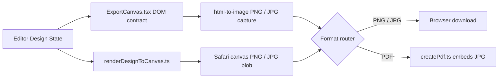

# Gripix System Architecture

This document describes the high-level system architecture, component relationships, data flow, and subsystem organization of Gripix.

---

## 1. System Overview

Gripix is built on **Next.js (App Router)**, **TypeScript**, **React 19**, and **Tailwind CSS**. It is architected as a high-performance, client-side graphic design application with local draft persistence and multi-format client-side export capabilities.

---

## 2. Route & Layout Architecture

- **`/` (Public Landing Page - [`app/page.tsx`](../app/page.tsx))**:
  - Responsive marketing landing page presenting Gripix features, Canva-style editor capabilities, and direct entry points to launch the editor.
- **`/create` (Editor Workspace Route - [`app/create/page.tsx`](../app/create/page.tsx))**:
  - Dedicated full-screen viewport workspace (`min-h-dvh md:h-dvh md:overflow-hidden`) hosting [`EditorPreview.tsx`](../components/EditorPreview.tsx).

---

## 3. Editor Core Architecture ([`components/EditorPreview.tsx`](../components/EditorPreview.tsx))

[`EditorPreview.tsx`](../components/EditorPreview.tsx) serves as the central stateful coordinator for the entire design application. It maintains:

### 1. Editor Design State (`EditorDesignState`)
- `items: DesignItem[]`: Array of canvas items (text blocks, uploaded images, vector SVG shapes). Array index dictates render z-order on the canvas.
- `canvas: CanvasSize & { presetId: CanvasPresetId }`: Target canvas dimensions (width, height) and active preset ID (e.g., `instagram-post`, `logo`, `custom`).

### 2. Transactional State History ([`useEditorHistory.ts`](../components/editor/useEditorHistory.ts))
- Manages history snapshots (`past`, `present`, `future`).
- Supports atomic single commits (`commitDesign`) and multi-frame gesture transactions (`beginTransaction`, `updateTransaction`, `commitTransaction`).

### 3. Viewport State (`EditorViewport`)
- `zoom`: Numerical zoom scale (e.g. `0.5`, `1.0`, `2.0`).
- `panX`, `panY`: Numerical canvas panning offsets in screen pixels.
- Derived functions from [`components/editor/editor.viewport.ts`](../components/editor/editor.viewport.ts) transform screen point coordinates to canvas relative points (`screenPointToCanvas`).

---

## 4. Canvas & Interaction Subsystems

### [`EditorCanvas.tsx`](../components/editor/EditorCanvas.tsx)
- Renders the interactive workspace boundary, canvas background color, active items, alignment snapping guides ([`AlignmentGuides.tsx`](../components/editor/AlignmentGuides.tsx)), desktop pan cursor overlays ([`DesktopPanCursor.tsx`](../components/editor/DesktopPanCursor.tsx)), and mobile zoom HUD ([`MobileCanvasZoomHud.tsx`](../components/editor/MobileCanvasZoomHud.tsx)).

### Canvas Item Renderers
- [`CanvasTextItem.tsx`](../components/editor/CanvasTextItem.tsx): Renders editable text, handles inline focus/caret placement, and auto-calculates text height. `TextDesignItem.textBoxWidth` is optional by design: present means an intentionally bounded wrapping box from a template or saved design; absent means free-form content hugs its intrinsic width until the real logical canvas room around the item's centre is exhausted, then wraps at that boundary while authored newlines remain explicit. Rotated free-form text uses projected horizontal/vertical room. Corner resizing changes `fontSize` proportionally and never persists or mutates a wrapping width. The measurement span, display layer, and zero-padding textarea use the same intrinsic box so the native caret, text, and selection overlay remain aligned.
- [`SelectionOverlay.tsx`](../components/editor/SelectionOverlay.tsx): A canvas-level interaction layer that measures the selected item, then renders only its ring and desktop handles above artwork. Content wrappers retain their true array layer order, so selection does not visually promote an object.
- [`CanvasImageItem.tsx`](../components/editor/CanvasImageItem.tsx): Renders uploaded raster images with boundary constraints and adjustment filters (brightness, contrast, saturation).
- [`CanvasShapeItem.tsx`](../components/editor/CanvasShapeItem.tsx): Renders vector SVG elements ([`ShapeSvg.tsx`](../components/editor/ShapeSvg.tsx)) based on element geometry definitions ([`shape.geometry.ts`](../components/editor/shape.geometry.ts)).

### Hit Testing Engine ([`components/editor/hitTesting.ts`](../components/editor/hitTesting.ts))
- Implements geometry-aware hit testing for shapes and smart pixel-alpha inspection for transparent PNG images. Ensures click/tap events register only on visible content rather than empty transparent container padding.

---

## 5. Inspection & Tooling Subsystems

- **[`EditorSidebar.tsx`](../components/editor/EditorSidebar.tsx)**: Left navigation sidebar managing tool selection tabs (Elements, Text, Uploads, Layers, Canvas Dimensions).
- **[`ElementsPanel.tsx`](../components/editor/ElementsPanel.tsx)**: Catalog browser for SVG shapes and starter graphics ([`elements.catalog.ts`](../components/editor/elements/elements.catalog.ts)).
- **[`FontPicker.tsx`](../components/editor/FontPicker.tsx)**: Typography browser supporting real-time font search, custom size stepping, line-height, letter-spacing, and font family application ([`font.catalog.ts`](../components/editor/fonts/font.catalog.ts)).
- **[`LayersPanel.tsx`](../components/editor/LayersPanel.tsx)**: Desktop and mobile layer inspector supporting drag/button reordering, layer locking (`isLocked`), and visibility toggles (`hidden`).
- **[`MobileContextToolbar.tsx`](../components/editor/MobileContextToolbar.tsx)**: Pinned mobile bottom toolbar providing contextual actions for selected elements.

---

## 6. Export Subsystem ([`lib/export/`](../lib/export/))

The export engine provides high-resolution, multi-format client-side asset generation:

- **[`renderDesignToCanvas.ts`](../lib/export/renderDesignToCanvas.ts)**: Pure offscreen HTML5 `<canvas>` rendering pipeline used by the Safari fallback. It draws items, text, images, and shapes with sub-pixel resolution accuracy, uses the same text-width/line-height contract as the editor and DOM export surface, waits for the selected font face, and preserves `object-contain` image geometry.
- **[`textLayout.ts`](../components/editor/textLayout.ts)**: The small shared text-rendering contract: explicit text-box validation, position/rotation-aware free-form boundary width, line height, font weight, and shadow. The live canvas, hidden DOM export surface, and Safari canvas fallback consume it so a design does not acquire a format-specific wrap point.

### Viewport Fit Contract

[`EditorCanvas.tsx`](../components/editor/EditorCanvas.tsx) measures the current workspace content box on every explicit Fit request, calculates the fit scale from the active logical canvas, and centres by committing zero pan. ResizeObserver supplies passive scale updates, but Fit does not rely on its potentially stale previous frame. Desktop preset changes and the mobile Fit control therefore share the same measure/scale/centre transaction across responsive and browser-chrome changes.
- **[`exportDesign.ts`](../lib/export/exportDesign.ts)**: Controller managing background transparency toggles, image format encoding (PNG, JPG), and browser file download triggers.
- **[`createPdf.ts`](../lib/export/createPdf.ts)**: Converts canvas output into single or multi-page PDF documents.
- **[`isMobileSafari.ts`](../lib/export/isMobileSafari.ts)**: Detects iOS Safari runtime environments to route downloads through compatible canvas data URL fallbacks.

---

## 7. Persistence Subsystem ([`lib/drafts/`](../lib/drafts/))

- **[`editorDraft.ts`](../lib/drafts/editorDraft.ts)**:
  - Automatically serializes `EditorDesignState` to `localStorage` on change.
  - Features state versioning, draft validation, state recovery on reload, and explicit draft reset capabilities.
