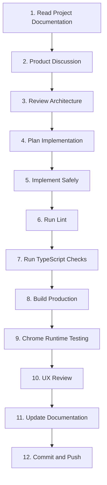

# Gripix Standard Operating Playbook

This document defines the 12-step standard operating workflow for developing, testing, verifying, and shipping features in Gripix.

All contributors and AI pairing assistants must strictly follow this sequential playbook for every task.

---

## The 12-Step Standard Workflow



---

### Step 1: Read Project Documentation
Before writing any code or making architectural changes:
- Read `AGENTS.md` for project rules, editor protection rules, and refactoring guidelines.
- Read `/docs/MASTER_PLAN.md` to understand business alignment and the 1% Rule.
- Read `/docs/ARCHITECTURE.md` to understand system state flow and component responsibilities.
- Check `/docs/POLISH_BACKLOG.md` and `/docs/ROADMAP.md` for relevant prior context.

### Step 2: Product Discussion
Evaluate the task against core product questions:
- Does this feature help users create, sell, save time, or make Gripix feel more premium?
- Can this feature be achieved with fewer clicks, better discoverability, and natural interaction?
- Does it respect desktop and mobile equality?

### Step 3: Review Architecture
Inspect affected codebase files before making edits:
- Check `components/EditorPreview.tsx` state interactions.
- Check domain subcomponents in `components/editor/`.
- Ensure proposed changes maintain `EditorPreview` as the state coordinator.
- Confirm touch/pointer event capture/bubble phase requirements.

### Step 4: Plan Implementation
Outline a concise, reviewable implementation plan:
- Prefer small, reviewable changes over large rewrites.
- Separate refactoring, visual redesign, and new functionality into distinct steps.
- Flag risks and get explicit approval before modifying gesture or state logic.

### Step 5: Implement Safely
Write code in accordance with engineering guidelines:
- Never break existing working editor features (drag, pinch/resize, text auto-fit, mobile caret).
- Preserve exact numeric values, array layer ordering, and stable keys.
- Do not introduce custom hooks, reducers, or Context without explicit approval.

### Step 6: Run Lint
Execute static analysis to ensure code style compliance:
```bash
npm run lint
```
- Report any lint errors and warnings separately.
- Do not proceed if new lint errors were introduced.

### Step 7: Run TypeScript Checks
Verify strict type safety:
```bash
npx tsc --noEmit
```
- Ensure zero TypeScript compiler errors exist.

### Step 8: Build Production
Validate Next.js compilation and SSR compatibility:
```bash
npm run build
```
- Verify the production build compiles cleanly without bundle or page route errors.

### Step 9: Run Chrome & Touch Runtime Testing
Perform runtime validation across desktop and mobile viewports:
- Test desktop canvas interaction (pan with space/middle-click, corner resize, toolbar actions).
- Test mobile viewports (Safari iPhone emulation, two-finger gesture ownership, touch caret placement, bottom toolbar).
- Verify export functionality (PNG transparent output, PDF generation).

### Step 10: Perform UX Review
Evaluate visual polish against `/docs/UX_PRINCIPLES.md`:
- Verify spacing, typography hierarchy, and color consistency.
- Ensure animations are subtle and interactive controls auto-hide appropriately.
- Confirm the 1% rule improvement is present and effective.

### Step 11: Update Documentation
Keep living documentation synchronized with code changes:
- Update `/docs/CHANGELOG.md` with new features or bug fixes.
- Update `/docs/ROADMAP.md` status badges if roadmap items are completed.
- Add unresolved observations or follow-ups to `/docs/POLISH_BACKLOG.md`.

### Step 12: Commit and Push
Only when explicitly instructed by the project lead/user:
- Check git status to ensure no unexpected files are modified.
- Craft a clear, descriptive commit message:
  ```bash
  git commit -m "docs: establish Gripix living project documentation"
  git push origin main
  ```
- *Rule: Never commit or push automatically, rewrite git history, or force push.*
